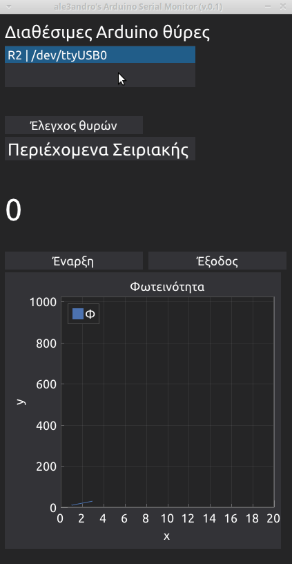

# alx_arduino_monitor

## Περί

Ένα python script, το οποίο σκανάρει τις σειριακές θύρες του Υπολογιστή για να εντοπίσει συνδεδεμένα κιτ S1 ή R2. 

Μόλις εντοπίσει Arduino, προσπαθεί να διαβάσει τη σειριακή με δεδομένα ταχύτητα (115200)

Εμφανίζει στην οθόνη της εφαρμογής τα δεδομένα που λαμβάνει από τη σειριακή κονσόλα.

Σε περίπτωση που τα δεδομένα είναι αριθμητικά, τότε εμφανίζει και ένα διάγραμμα.

## Showcase

## Χρήση

Η εφαρμογή δεν χρειάζεται εγκατάσταση. Είναι ένα σκέτο εκτελέσιμο αρχείο. 

Κατεβάζεις από τα [releases](https://github.com/ale3andro/alx_arduino_logger/releases) το κατάλληλο αρχείο για το ΛΣ που χρησιμοποιείς (Linux / Windows) και το ανοίγεις. 

