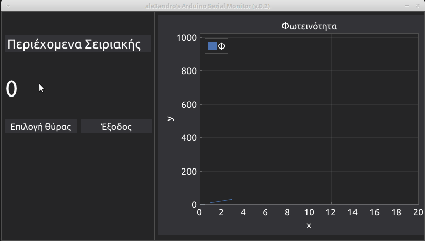

# alx_arduino_monitor

## Περί

Ένα python script, το οποίο σκανάρει τις σειριακές θύρες του Υπολογιστή για να εντοπίσει συνδεδεμένα κιτ S1 ή R2. 

Μόλις εντοπίσει Arduino, προσπαθεί να διαβάσει τη σειριακή με δεδομένα ταχύτητα (115200)

Εμφανίζει στην οθόνη της εφαρμογής τα δεδομένα που λαμβάνει από τη σειριακή κονσόλα.

Σε περίπτωση που τα δεδομένα είναι αριθμητικά, τότε εμφανίζει και ένα διάγραμμα.

## Changelog

** 2024.11.23 ** | Προσθήκη λίστας με επιλογές μετρήσεων ώστε να γίνεται το κατάλληλο scaling στον άξονα y

** 2024.11.22 ** | Έκδοση 0.2 - Επανασχεδίαση του GUI

## Showcase

## Χρήση

Η εφαρμογή δεν χρειάζεται εγκατάσταση. Είναι ένα σκέτο εκτελέσιμο αρχείο. 

Κατεβάζεις από τα [releases](https://github.com/ale3andro/alx_arduino_logger/releases) το κατάλληλο αρχείο για το ΛΣ που χρησιμοποιείς (Linux / Windows) και το ανοίγεις.

## ΠΡΟΣΟΧΗ

Όταν η εφαρμογή είναι ανοιχτή και λαμβάνει δεδομένα από το κιτ, δεσμεύει την σειριακή θύρα οπότε δεν είναι δυνατόν το upload νέου σεναρίου από το Mind+. Το Mind+ εμφανίζει **upload error**, περίπου σαν αυτό της παρακάτω εικόνας.

Σε αυτή την περίπτωση, πρέπει να κλείσει το monitor app, να γίνει το upload του νέου σεναρίου από το Mind+ και μετά να ανοίξει και πάλι το monitor.

